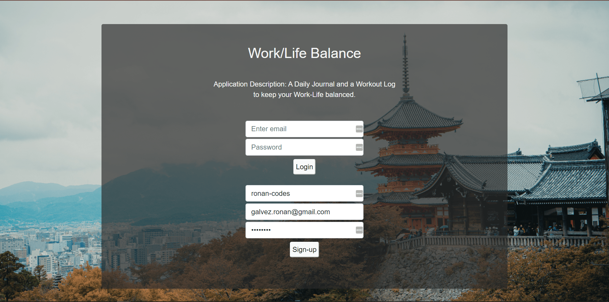
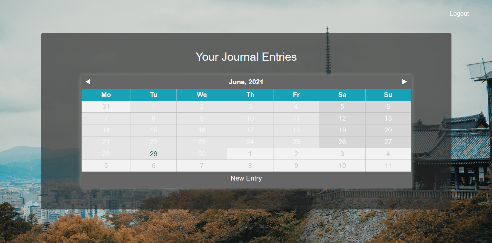
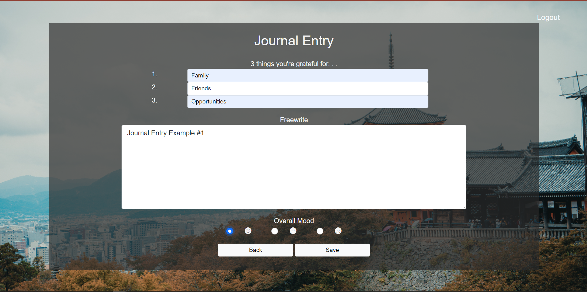
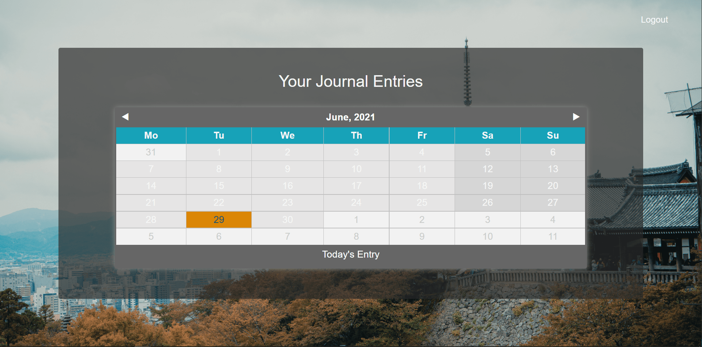
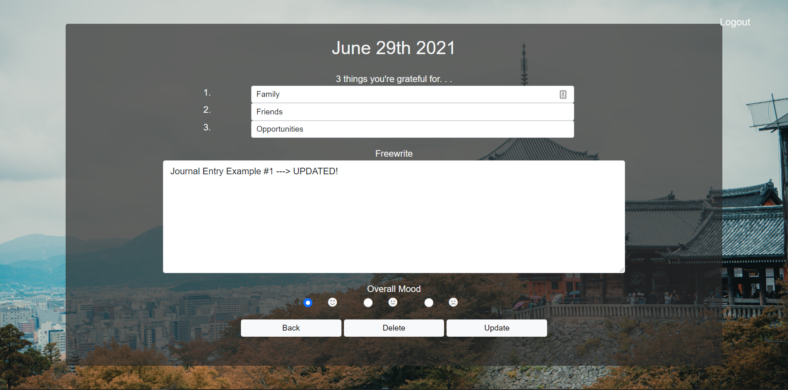

# Self-Care 

## Description

* Self-Care is a simple and convenient journaling app. It utilizes a third-party datepicker app (Zebra Datepicker) to seemlessly keep record of daily journal entries. Future developments may include a workout-log portion, and other self-care related features (Ex. daily motivational quotes).

## Table of Contents

1. [Description](#Description)
2. [Technologies](#Technologies)
3. [Installation](#Installation)
4. [Usage](#Usage)
5. [Screenshots](#Screenshots)
6. [License](#License)
7. [Contributing](#Contributing)
8. [Author](#Author)
9. [GitHub](#GitHub)

## Technologies
* HTML
* Bootstrap & CSS
* JavaScript & JQuery
* Bcrypt
* Connect-Session-Sequelize
* Dotenv
* Express.js, Express-Handlebars, Express-Session
<!-- check if still utilized Inquirer -->
* Inquirer
* MySQL2
* Sequelize
* Zebra Datepicker (NPM Package)

## Installation
1. Clone repository
2. `npm install` at root of folder
    * This will install all the dependencies listed in package.json
3. At root of application, create an .env file and insert MySQL credentials (username & password). DB_Name must be 'life_balance_db'
    * DB_NAME='life_balance_db'
    * DB_USER='username'
    * DB_PW='password'

## Usage
### Run Locally
1. At application's root, connect to mysql and run "source db/schema.sql". (Creates life_balance_db).
3. Initiate the server with "npm start".
4. Visit http://localhost:3001/ in your browser (Preferred: Chrome / Safari)
5. Now, you can sign-up/login, create journal-entries at specific dates, and edit/delete your journal-entries.

### Heroku
1. Visit the live site at [heroku](https://ronan-codes-self-care.herokuapp.com/)
2. Now, you can sign-up/login, create journal-entries at specific dates, and edit/delete your journal-entries.

## Screenshots
1. Signup/Login

2. Date Picker

3. New Journal Entry

4. Update/Delete Existing Entry

5. Updated Journal Entry

## License
This project is in the public domain and free for any and all users! For more information on this (un)licensing statement, visit https://unlicense.org/

## Contributing
* If you'd like to contribute to this project, please follow the rules of the [Contributor Covenant](https://www.contributor-covenant.org/)

## Author
This application was written and developed primarily by Ronan Galvez for the Module 15-16 group project assignment of the UCF Coding Bootcamp. For any questions/suggestions/concerns, open an issue or contact me directly at [galv.ronan@gmail.com](galv.ronan@gmail.com). Check out the rest of my work on GitHub at [Ronan-Codes](https://github.com/Ronan-Codes).

## GitHub
 * [GitHub Repository](https://github.com/Ronan-Codes/project-2.git)
